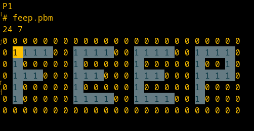

= Advent of Code 2022
:doctype: book
:toc: macro
:sectnums:

image:https://godoc.org/gitlab.com/jhinrichsen/adventofcode2022?status.svg["godoc", link="https://godoc.org/gitlab.com/jhinrichsen/adventofcode2022"]
image:https://goreportcard.com/badge/gitlab.com/jhinrichsen/adventofcode2022["Go report card", link="https://goreportcard.com/report/gitlab.com/jhinrichsen/adventofcode2022"]
image:https://gitlab.com/jhinrichsen/adventofcode2022/badges/main/pipeline.svg[link="https://gitlab.com/jhinrichsen/adventofcode2022/-/commits/main",title="pipeline status"]
image:https://gitlab.com/jhinrichsen/adventofcode2022/badges/main/coverage.svg[link="https://gitlab.com/jhinrichsen/adventofcode2022/-/commits/main",title="coverage report"]
image:https://img.shields.io/badge/runtime-4.3%20s-brightgreen.svg["runtime: 4.3 s"]

toc::[]

My take on https://adventofcode.com/2022/ in Go. As usual, i don't particularly
care if i provide my solutions _fast_, i try to be _correct_ on the first
answer, and care for being runtime efficient.

Answers are hard coded into the unit tests.

== Number of tries

|===
| Day | Part 1 | Part 2
| 1   |   1    | 1
| 2   |   1    | 1
| 3   |   1    | 1
| 4   |   2    | 1
| 5   |   1    | 1
| 6   |   1    | 1
| 7   |   2    | 1
| 8   |   1    | 1
| 9   |   1    | 1
| 10  |   1    | 1
| 11  |   1    | 1
| 12  |   1    | 1
| 13  |   1    | 1
| 14  |   1    | 1
| 15  |   1    | 1
| 16  |   1    | 1
| 17  |   1    | 2
| 18  |   1    | 2
| 19  |   1    | 1
| 20  |   3    | 1
| 21  |   1    | 1
| 22  |   2    | 1
| 23  |   1    | 1
| 24  |   1    | 1
| 25  |   1    | 1
|===

== Day 1

Benchmark:
----
CGO_ENABLED=0 go test -bench=. -run="" -benchmem
goos: linux
goarch: amd64
pkg: gitlab.com/jhinrichsen/adventofcode2022
cpu: AMD Ryzen 5 3400G with Radeon Vega Graphics
BenchmarkDay01Part2-8   	   19648	     66464 ns/op	    4144 B/op	      11 allocs/op
PASS
ok  	gitlab.com/jhinrichsen/adventofcode2022	1.934s
----

== Day 2

Implementation of a map based lookup took 25 min for part1.

Benchmark for map inside function:
----
BenchmarkDay02Part1-8   	   20312	     60303 ns/op	     416 B/op	       1 allocs/op
----

Benchmark for static map outside of function:

----
BenchmarkDay02Part1-8   	   20782	     55999 ns/op	       0 B/op	       0 allocs/op
----

56 ms for 2.500 draws, i.e. 22 ns for one draw or 45 MHz.
We are churning draws at three times the CPU frequency of an Arduino.

== Day 3

----
BenchmarkDay03-8   	   22658	     48739 ns/op	       0 B/op 0 allocs/op (1)
----
(1) Go 1.18

48739 ns/op for 300 op is 162 ns/op or 6 MHz.

Coming back for part 2.
Slightly rearranging my code to separate the intersect() and prio() part.
Haskell teaches you that there is no such thing as f(a, b).
Karma is to be found within functional composition.
`intersect(a, b, c) === intersect(intersect(a, b), c)`

Although slightly more generic, part 1 shows

----
BenchmarkDay03Part1-8   	   26200	     43238 ns/op	    2400 B/op	     300 allocs/op (1)
BenchmarkDay03Part2-8   	   10000	    150718 ns/op	    6192 B/op	     368 allocs/op
----
(1) Go 1.19

When intersecting, the outer `intersect()` can stop after the first match (as
does part 1).

----
name          old time/op    new time/op    delta
Day03Part1-8    47.7µs ± 7%    48.2µs ±10%     ~     (p=0.481 n=10+10)
Day03Part2-8     162µs ±10%     131µs ±15%  -19.41%  (p=0.000 n=10+10)
----

== Day 4

First try failed, stupid error in `Contains()` predicate.
The bad code below will mark the two ranges as fully contained, but they are
not.
----
	// Error: [4-94] [3-3] marked as fully contained. Spot the error?
	return b1 <= a1 && b2 <= a2 || a1 <= b1 && b2 <= a2
----

Benchmark results:
----
name          time/op
Day04Part1-8   604µs ±12%
Day04Part2-8   621µs ±10%

name          alloc/op
Day04Part1-8  96.0kB ± 0%
Day04Part2-8  96.0kB ± 0%

name          allocs/op
Day04Part1-8   3.00k ± 0%
Day04Part2-8   3.00k ± 0%
----

== Day 5
During unit testing, i corrected these two errors:

- Stacks are 1-based, not 0-based
- The result consists of the _last_ crate of each stack, not the _first_

----
BenchmarkDay05-8   	  529513	      2985 ns/op	    4145 B/op	       3 allocs/op
----

== Day 6

Benchmark for puzzle input 1, 4 KB/ 4096 Bytes per op:
----
BenchmarkDay06-8   	   10000	    105913 ns/op	       0 B/op	       0 allocs/op
----

Generic hashmap based implementation for part 1 and part 2:
----
BenchmarkDay06Part1-8   	   10270	    131068 ns/op	       0 B/op	       0 allocs/op
BenchmarkDay06Part2-8   	    5142	    199927 ns/op	     653 B/op	       5 allocs/op
----

26 ns per byte, equals 39 MHz. At a marker size of 14, garbage collection seems
to kick in because of the hashmap being larger than default.

Retry the bits.OnesCount() approach, this time using a fresh window for each
step and _not_ trying to slide:

----
BenchmarkDay06Part1-8   	  156498	      7430 ns/op	       0 B/op	       0 allocs/op
BenchmarkDay06Part2-8   	   40934	     27027 ns/op	       0 B/op	       0 allocs/op
----

Much better. Want to know what happens under the hood?

----
00079 (day06.go:49)	MOVBQZX	runtime.x86HasPOPCNT(SB), DX   ; check if CPU supports POPCNT instruction
00087 (day06.go:49)	TESTL	DX, DX
00089 (day06.go:52)	JEQ	98                             ; no, continue at 98
00091 (day06.go:52)	POPCNTL	DI, DI                         ; yes, execute
00095 (day06.go:52)	NOP
00096 (day06.go:52)	JMP	151                            ; continue next command
00098 (day06.go:47)	MOVQ	BX, ""..autotmp_8+24(SP)       ; prepare stack based function call
00103 (day06.go:49)	MOVQ	R8, ""..autotmp_9+16(SP)
00108 (day06.go:52)	MOVL	DI, AX
00110 (day06.go:52)	PCDATA	$1, $0
00110 (day06.go:52)	CALL	math/bits.OnesCount32(SB)      ; call Go based implementation
00115 (day06.go:52)	MOVQ	"".size+64(SP), CX
----

== Day 07

Ok, pretty straightforward, but unit tests fail because of 'total size of at
most 100000. I misread as "larger than 100000", because we are searching for big
ones, no?

First try fails miserably.
A couple of checks all look good.
In the end, i search for a working implementation, and trace back my error.
I do not cater for empty intermediate directories, i.e. i don't account for `b`
in `/a/b/c/d.ext` if `b` has no files in it.
Second try works.

Second puzzle unit tests ran successfully the first time.

== Day 8

For the first time, personal leaderboard shows me in 5 digit position.

----
      --------Part 1---------   --------Part 2---------
Day       Time    Rank  Score       Time    Rank  Score
  8       >24h   75414      0          -       -      -
  7       >24h   79816      0       >24h   78203      0
  6       >24h  112214      0       >24h  111265      0
  5       >24h  115470      0          -       -      -
  4       >24h  133385      0          -       -      -
  3       >24h  142512      0          -       -      -
  2       >24h  167617      0       >24h  161452      0
  1       >24h  197787      0       >24h  190653      0
----

== Day 10

Upgraded to Fedora 37, which brings Go 1.19.3.

Took me a while (40 min) to figure out that the register changes _after_ the
second cycle.
Interestingly, no off-by-one error this time.

----
BenchmarkDay10-8   	  692694	      2291 ns/op	    2304 B/op	       1 allocs/op
----

2300 ns/op for 138 instructions is 17 ns per instruction, i.e. 60 MHz.

When checking which instruction to execute, comparing the command like `op ==
"noop"` is the same speed as `op[0] == 'n'`.

Rolling our own strconv.Atoi() parser:
----
BenchmarkDay10-8   	  964717	      1665 ns/op	    2304 B/op	       1 allocs/op
----

Nice, shaved 30% off.
1665 ns/op for 138 instructions is 17 ns per instruction, i.e. 83 MHz.

----
$ benchstat day10_atoi.txt day10_custom.txt
name     old time/op    new time/op    delta
Day10-8    2.92µs ± 3%    2.05µs ± 6%  -29.72%  (p=0.000 n=19+17)

name     old alloc/op   new alloc/op   delta
Day10-8    2.30kB ± 0%    2.30kB ± 0%     ~     (all equal)

name     old allocs/op  new allocs/op  delta
Day10-8      1.00 ± 0%      1.00 ± 0%     ~     (all equal)
----

Our virtual CPU at 83 MHz is at least half as fast as the clock on an Espressif
32-Bit-RISC-V-MCU at 160 MHz.

I just realized everything i contributed so far has been on my reddit account,
not my google account as in previous years. I just lost 7000 places, but i am at
91% do that should not matter.

----
      --------Part 1---------   --------Part 2---------
Day       Time    Rank  Score       Time    Rank  Score
 10   19:12:40   50125      0          -       -      -
  9       >24h   61568      0          -       -      -
  8       >24h   80585      0          -       -      -
  7       >24h   84244      0       >24h   82424      0
  6       >24h  118055      0       >24h  117019      0
  5       >24h  121567      0       >24h  119444      0
  4       >24h  143620      0       >24h  141247      0
  3       >24h  161404      0       >24h  153837      0
  2       >24h  187765      0       >24h  179743      0
  1       >24h  224250      0       >24h  215380      0
----

Well worth switching, my google account looks so much nicer.

=== Part 2

Part 2 returns characters as ASCII art, so this would require human interaction.
As an example, here's the output of a sample Plain PBM (portable Bit Map).
Can you spot the text? I can't.

----
P1
# feep.pbm
24 7
0 0 0 0 0 0 0 0 0 0 0 0 0 0 0 0 0 0 0 0 0 0 0 0
0 1 1 1 1 0 0 1 1 1 1 0 0 1 1 1 1 0 0 1 1 1 1 0
0 1 0 0 0 0 0 1 0 0 0 0 0 1 0 0 0 0 0 1 0 0 1 0
0 1 1 1 0 0 0 1 1 1 0 0 0 1 1 1 0 0 0 1 1 1 1 0
0 1 0 0 0 0 0 1 0 0 0 0 0 1 0 0 0 0 0 1 0 0 0 0
0 1 0 0 0 0 0 1 1 1 1 0 0 1 1 1 1 0 0 1 0 0 0 0
0 0 0 0 0 0 0 0 0 0 0 0 0 0 0 0 0 0 0 0 0 0 0 0
----

However, selecting the block in vim, and applying `:%s/1 /` reveals the text.

Instead, let's use OCR to automate this step.
Tesseract will succeed, but requires host OS support.
Gosseract will fail for whatever reason https://github.com/otiai10/gosseract/issues/266[Issue 266].
https://gitlab.com/jhinrichsen/aococr[AOC OCR] to the rescue.

== Day 11

`Monkey` parsing was a bit of an typing effort, but a no-brainer.
Looking at Monkey #0 and #1, and their Operations (`* 19` and `+ 6`) make me
start a simple handrolled parser.
For Monkey #3 (`new = old * old`) i switched from this basic parser to the Go
internal `eval()` equivalent.
While every Python programmer is familiar with `eval()`, the Go equivalent is
rather unknown.

But yes, Go is self hosted, which means its compiler is written in Go.
So you can use Go to parse *and evaluate* an expressions.
Remember that `new = old * old` is a statement, and `old * old` an expression.

----
// Eval uses Go's internal compiler to evaluate an expression.
func Eval(expr string, m map[string]float64) float64 {
	// wipe global scope
	types.Universe = types.NewScope(nil, token.NoPos, token.NoPos, "universe") (1)

	for k, v := range m {
		c := types.NewConst(
			token.NoPos,
			nil,
			k,
			types.Typ[types.Float64],
			constant.MakeFloat64(float64(v)))
		types.Universe.Insert(c)
	}

	fs := token.NewFileSet()
	tv, err := types.Eval(fs, nil, token.NoPos, expr)
	if err != nil {
		panic(err)
	}
	n, _ := constant.Float64Val(tv.Value)
	return n
}
----
(1) Do not forget to redeclare global between calls, otherwise `old` will be
evaluated once, and the cached value returned for the next call.

For part #2, this approach blows miserably.
I started using an `int` based implementation, but it resulted in integer
overflow.
Switching from `int` to `float64` did not improve the situation, somewhere up
and above `1e376` even float64 reaches its end of precision.

In earlier years, i would have switched to arbitrary precision library.
But all in all the number crunching part of AOC has vanished.
I remember years 201x when CPU and fan went ballistic for 15 minutes to
calculate a solution, but nowadays typical runtimes are usually subsecond.
In addition, all four divisors in the example are primes, and you don't fight
primes with CPU.
So, obviously, switching to https://pkg.go.dev/math/big[arbitrary-precision
arithmetic]
(big numbers) seems a dead end.

I took a peek at the reddit hint channel, where people talked about abstract
number theory, and x^2^ divided by n can be reduced to mumble mumble mumble.

So here's why i don't do part 2:

* It seems you need to look at the actual expressions to derive a solution to
  keep your worry levels low
* I understand the division part, and taking a short circuit on the expression,
  but the result is passed to the next monkey, and this result is different. I
  accept you can bring down worry level `1e376` to, say, `15`, but then this is
  passed to the next monkey, and `1e376+3` is definitely different from `15+3`.
* I do not know how to write an abstract algebraic resolver
* I do not want to know how to write one

Please go ahead and read about the Xerox JBIG2 problem, and optimization issues.

So for now, another unsolved puzzle in a long line of unresolved puzzles.

----
[2022] 18*
[2021] 18*
[2020] 45*
[2019] 26*
[2018] 14*
[2017] 13*
[2016] 32*
[2015] 50*

Total stars: 216*
----

Time to apply the `¯\_(ツ)_/¯` pattern.

== Day12

Looks like a path finding problem, Dijkstra to the rescue.
I grep'ed my old AOCs, and 2016's day 13 was the same category.
Back then i used an https://github.com/beefsack/go-astar[external A* library].
Although only 2 contributors, i picked it because of its nice examples that fit
well.
This time, none of the standard examples worked out, so i had to dive deeper
into the library.

=== beefsack's go-astar library

The function signature to calculate a path is

----
func Path(from, to Pather) (path []Pather, distance float64, found bool)
----

No surprises so far. Pather is an dominant interface

----
type Pather interface {
	// PathNeighbors returns the direct neighboring nodes of this node which
	// can be pathed to.
	PathNeighbors() []Pather

----

Of course, Pather need to find their neighbors somehow.
But this single interface signature leads to a problem.
In path finding, you usually have an area, often a grid, and cells.
In our Day 13 puzzle, the puzzle input is the area, and S (the starting point),
and E (the end point) are two cells in this area.
Now, should area or cell implement the Pather interface?
Obviously, only cells have neighbours.
But cells need access to the world to find their neighbors.

In the library examples, the area is called World, and a cell is called Tile.
The world has references to Tiles, and each and every Tile has a backref to the
world.
On top, you have the Day 13 grid itself, so we are housekeeping three data
lakes.
Anyway, we need to ship this thing out the door, so why bother.
Go being a statically typed language and everything, both `go build` and `go
vet` agree we have made it.

But.

CAUTION: panic() somewhere deep inside the guts of the external library.

=== Workaround #1

The library keeps track of the Day 13 struct that implements Pather.
It does so by storing cells in an internal map.
And Go's map has some limitations when it comes to storing.
Long story short you can only store something that is comparable by ==.
And channels, slices, and functions (just to name a few) cannot be compared
using ==.
Our Day12 struct has a slice to all of its navigatable neighbors.

Slices cannot be compared, but arrays can.
So, instead of an undefined number of []neighbors, we know that we can move only
left, right, top, or down, so [4]neighbors, returning the array as a slice as
dicated by the Pather interface: neighbors[:].

CAUTION: runtime error: invalid memory address or nil pointer dereference

=== Workaround #2

The panic() is again buried deeply inside the guts of the external library.
Ok, seems as if  2 passengers in a car built for 4 is not going to happen.
Hand peeling off unused neighbors, and returning the slice neighbors[0:n].

CAUTION: panic: runtime error: hash of unhashable type

Seems as if we made it past the initial stage, but when applying the heuristic
part of A*, the priority queue reads

----
func (pq *priorityQueue) Push(x interface{}) {
----

Well, one of my personal don'ts.
https://www.youtube.com/watch?v=PAAkCSZUG1c&t=456s[interface{} says nothing]
Even in C, the void * carries more information than interface{}.
You know it is a pointer, at least.
interface{} in Go has about the same information as void in C.
Nothing.
Anything.
Both.
One or the other.
I never use it, because i am stupid and i NEED the compiler, its type checker,
and go vet.

=== Workaround #3

Throw the beefstack library out of the window and migrate to a library that has
a better user interface.

=== gonum to the rescue

https://pkg.go.dev/gonum.org/v1/gonum/graph/path[gonum] seems like a reasonable
choice.
489 forks, 6.2k stars.
A* by Peter Hart, Nils Nilsson and Bertram Raphael.
Dijkstra, Floyd-Warshall, Joseph Kruskal, Jin Y. Yen, the who-is-who of path
finding.

The signature for A* reads
----
func AStar(s, t graph.Node, g traverse.Graph, h Heuristic) (path Shortest, expanded int)
----

s source, t target node, our cell.

g traverse Graph, our world.

h, the add-on compared to Dijkstra, and a default
https://github.com/gonum/gonum/blob/v0.12.0/graph/path/a_star.go#L99[
NullHeuristic].

Plus, i still have an open position for a good DAG lib, so i'll try gonum.

gonum lacks some example documentation, but other than that it works like a
charm.

== Day 17

Got part 1 right on first try.
For part 2, 1_000_000_000_000 cycles does not sound reasonable, even in Go.

TODO: There must be some sort of cycle.
I'd keep the surface of the tower as a 7 numbers wide pattern, plus the shape
ID, plus the resulting surface, plus the increase in height.

----
goos: linux
goarch: amd64
pkg: gitlab.com/jhinrichsen/adventofcode2022
cpu: AMD Ryzen 5 3400G with Radeon Vega Graphics
BenchmarkDay17-8   	       4	 260115105 ns/op	 6856332 B/op	   98400 allocs/op
BenchmarkDay17-8   	       5	 264100830 ns/op	 6853804 B/op	   98396 allocs/op
BenchmarkDay17-8   	       4	 251712320 ns/op	 6855952 B/op	   98398 allocs/op
BenchmarkDay17-8   	       4	 278862097 ns/op	 6856078 B/op	   98399 allocs/op
BenchmarkDay17-8   	       5	 254284389 ns/op	 6853601 B/op	   98395 allocs/op
BenchmarkDay17-8   	       4	 258276054 ns/op	 6857392 B/op	   98406 allocs/op
BenchmarkDay17-8   	       5	 268423537 ns/op	 6852992 B/op	   98392 allocs/op
BenchmarkDay17-8   	       4	 250643994 ns/op	 6855890 B/op	   98398 allocs/op
BenchmarkDay17-8   	       4	 271031566 ns/op	 6854496 B/op	   98386 allocs/op
BenchmarkDay17-8   	       4	 267536665 ns/op	 6856402 B/op	   98399 allocs/op
----

=== Optimization

Replaced shape maps with slices and eliminated temporary Sprite allocations in
collision detection. Changed from creating intermediate Sprite objects via
Translate() to direct position checking with slices.

----
name          old time/op    new time/op    delta
Day17Part1-16    105ms ± 1%      96ms ± 2%   -8.31%
----

== Day 18

Got part 2 wrong, i think i need to cater for interior air holes that stick
together.

TODO: move from 0,0,0 to maxX, maxY, maxZ until the first non-empty cube is
reached.
Then, keeping left hand on the object, flood-fill along the border to count
surface elements.

== Day 19

TODO: need to maxmize the throughput. Keep a list of quotients for each factory,
and build new stuff to minimize current quotients against optimal quotient.

=== Optimization

Parallelized blueprint processing using goroutines. Each blueprint is processed
independently in its own goroutine, reducing wall-clock time.

----
name          old time/op    new time/op    delta
Day19Part1-16    1.29s ± 0%     0.40s ± 0%  -69.01%
Day19Part2-16    2.50s ± 0%     0.84s ± 0%  -66.40%
----

== Day 20

So easy the problem, so nasty the implementation.
I started copy()ing slices around, using an working buffer in analogy to a
offscreen image, and filling like

----
count int

add = func(is []int) {
    count += copy(dst[count:], is)
}
----

Unfortunately, i never got the indexes and the wrapping and the left/right
correct.

For a second strategy, i projected the mix to a bubble sort, i.e. the number is
swapped with it immediate neighbour to the left or to the right N times.

When wrapping would occur, it is replaced with swapping to the other direction.

=== Tries

|===
| Attempt | Value  | Status
| 1       | -6459  | Wrong (too high)
| 2       | -6750  | Wrong
| 3       | 11616  | Correct
|===

Bug was in the mixing algorithm: movement calculations must use modulo (len-1)
since the element is removed before calculating the new position. Rewrote to
use Node struct tracking original indices for proper order processing.

=== Optimization

Replaced slice-based implementation with circular doubly-linked list.
Original used linear search O(n) and slice splice operations O(n) for each
move, resulting in O(n²) per mix. Linked list provides O(1) insert/remove
and direct node access via array of pointers.

----
name          old time/op    new time/op    delta
Day20Part1-16   95.9ms ± 7%    34.5ms ± 1%  -63.98%
Day20Part2-16    1.02s ±14%     0.46s ± 1%  -55.20%

name          old alloc/op   new alloc/op   delta
Day20Part1-16    204MB ± 0%       0MB ± 0%  -99.89%
Day20Part2-16   2.00GB ± 0%    0.00GB ± 0%  -99.99%

name          old allocs/op  new allocs/op  delta
Day20Part1-16    5.01k ± 0%     5.00k ± 0%   -0.12%
Day20Part2-16    50.1k ± 0%      5.0k ± 0%  -90.01%
----

== Day 24

BFS pathfinding through valley with moving blizzards.

=== Tries

|===
| Attempt | Value  | Status
| 1       | 300    | Wrong (too high)
| 2       | 299    | Correct
|===

First attempt failed due to incorrect blizzard wrapping logic. The modulo
arithmetic didn't handle negative coordinates properly, causing blizzards to
appear in incorrect positions (including wall rows). This created a wrong
simulation of the blizzard field, causing BFS to find a suboptimal path and
return 300 instead of the correct 299.

Fixed by properly converting to 0-based coordinates, applying correct modulo
`((x % mod) + mod) % mod`, then converting back to 1-based. Added comprehensive
tests for all 19 intermediate blizzard states from the example walkthrough to
prevent regression.

== Day 21

Nice example for channels.
Reading from a close()d channel returns the empty value without blocking.

----
$ go test -run=xxx -bench=Day21 -benchmem -count=10
goos: darwin
goarch: amd64
pkg: gitlab.com/jhinrichsen/adventofcode2022
cpu: Intel(R) Core(TM) i9-9980HK CPU @ 2.40GHz
BenchmarkDay21Part1-16    	     718	   1622373 ns/op	  930030 B/op	    9248 allocs/op
BenchmarkDay21Part1-16    	     742	   1601952 ns/op	  929759 B/op	    9245 allocs/op
BenchmarkDay21Part1-16    	     744	   1598219 ns/op	  929678 B/op	    9244 allocs/op
BenchmarkDay21Part1-16    	     736	   1600565 ns/op	  929125 B/op	    9238 allocs/op
BenchmarkDay21Part1-16    	     717	   1606044 ns/op	  929628 B/op	    9244 allocs/op
BenchmarkDay21Part1-16    	     744	   1607683 ns/op	  929422 B/op	    9241 allocs/op
BenchmarkDay21Part1-16    	     746	   1599818 ns/op	  929315 B/op	    9240 allocs/op
BenchmarkDay21Part1-16    	     734	   1620898 ns/op	  930152 B/op	    9249 allocs/op
BenchmarkDay21Part1-16    	     741	   1610202 ns/op	  929156 B/op	    9239 allocs/op
BenchmarkDay21Part1-16    	     718	   1601254 ns/op	  929563 B/op	    9243 allocs/op
----

Around 1.6 ms for 2.265 monkeys.

== Day 22

Got caught in triple logic (wall, walk, wrap) in a map[complex128]bool.

== Day 25

Trying a + operator in the Snafu domain, i.e. without conversion to decimal.
Got it right on the first try.
The algorithm is pretty slow, about 15 times slower as a conversion to dec and then using the CPU's ADD operation.

== Benchmarks

The total runtime to run each the benchmark for each day (1..25), part 1 and 2 (except for day 25, which does not have a part 2) is

----
1895712088.80 ns, 1895712.089 µs, 1895.712 ms, 1.895712 s
----

Not subsecond, but close.

----
include::benches/linux-amd64-intelr_coretm_i7-14700k.txt
----

Disabling GC will shave off ~30%

----
goos: linux
goarch: amd64
pkg: gitlab.com/jhinrichsen/adventofcode2022
cpu: Intel(R) Core(TM) i7-14700K
              │    gc.txt     │               nogc.txt                │
              │    sec/op     │    sec/op     vs base                 │
Day01Part1-28    12.85µ ± ∞ ¹   12.95µ ± ∞ ¹        ~ (p=1.000 n=1) ²
Day01Part2-28    13.05µ ± ∞ ¹   12.86µ ± ∞ ¹        ~ (p=1.000 n=1) ²
Day02Part1-28    11.93µ ± ∞ ¹   14.80µ ± ∞ ¹        ~ (p=1.000 n=1) ²
Day02Part2-28    11.81µ ± ∞ ¹   11.86µ ± ∞ ¹        ~ (p=1.000 n=1) ²
Day03Part1-28    17.99µ ± ∞ ¹   18.44µ ± ∞ ¹        ~ (p=1.000 n=1) ²
Day03Part2-28    63.18µ ± ∞ ¹   63.29µ ± ∞ ¹        ~ (p=1.000 n=1) ²
Day04Part1-28   148.98µ ± ∞ ¹   73.18µ ± ∞ ¹        ~ (p=1.000 n=1) ²
Day04Part2-28   178.91µ ± ∞ ¹   76.14µ ± ∞ ¹        ~ (p=1.000 n=1) ²
Day05Part1-28   3063.0n ± ∞ ¹   626.5n ± ∞ ¹        ~ (p=1.000 n=1) ²
Day05Part2-28   3137.0n ± ∞ ¹   719.8n ± ∞ ¹        ~ (p=1.000 n=1) ²
Day06Part1-28    4.397µ ± ∞ ¹   4.455µ ± ∞ ¹        ~ (p=1.000 n=1) ²
Day06Part2-28    16.51µ ± ∞ ¹   16.43µ ± ∞ ¹        ~ (p=1.000 n=1) ²
Day07Part1-28    2.710m ± ∞ ¹   2.732m ± ∞ ¹        ~ (p=1.000 n=1) ²
Day07Part2-28    2.705m ± ∞ ¹   2.726m ± ∞ ¹        ~ (p=1.000 n=1) ²
Day08Part1-28    155.5µ ± ∞ ¹   156.3µ ± ∞ ¹        ~ (p=1.000 n=1) ²
Day08Part2-28    206.7µ ± ∞ ¹   206.2µ ± ∞ ¹        ~ (p=1.000 n=1) ²
Day09Part1-28   1017.5µ ± ∞ ¹   598.2µ ± ∞ ¹        ~ (p=1.000 n=1) ²
Day09Part2-28    877.0µ ± ∞ ¹   866.9µ ± ∞ ¹        ~ (p=1.000 n=1) ²
Day10Part1-28   1709.0n ± ∞ ¹   474.5n ± ∞ ¹        ~ (p=1.000 n=1) ²
Day10Part2-28    4.600µ ± ∞ ¹   1.458µ ± ∞ ¹        ~ (p=1.000 n=1) ²
Day11Part1-28    48.80µ ± ∞ ¹   16.36µ ± ∞ ¹        ~ (p=1.000 n=1) ²
Day11Part2-28   17.753m ± ∞ ¹   5.513m ± ∞ ¹        ~ (p=1.000 n=1) ²
Day12Part1-28    5.910µ ± ∞ ¹   5.868µ ± ∞ ¹        ~ (p=1.000 n=1) ²
Day12Part2-28    5.819µ ± ∞ ¹   5.841µ ± ∞ ¹        ~ (p=1.000 n=1) ²
Day13Part1-28   1195.4µ ± ∞ ¹   751.3µ ± ∞ ¹        ~ (p=1.000 n=1) ²
Day13Part2-28   1666.6µ ± ∞ ¹   821.6µ ± ∞ ¹        ~ (p=1.000 n=1) ²
Day14Part1-28    1.749m ± ∞ ¹   1.752m ± ∞ ¹        ~ (p=1.000 n=1) ²
Day14Part2-28    95.71m ± ∞ ¹   96.97m ± ∞ ¹        ~ (p=1.000 n=1) ²
Day15Part1-28    9.969µ ± ∞ ¹   4.689µ ± ∞ ¹        ~ (p=1.000 n=1) ²
Day15Part2-28    45.30m ± ∞ ¹   43.25m ± ∞ ¹        ~ (p=1.000 n=1) ²
Day16Part1-28    40.53m ± ∞ ¹   33.93m ± ∞ ¹        ~ (p=1.000 n=1) ²
Day16Part2-28    165.0m ± ∞ ¹   164.7m ± ∞ ¹        ~ (p=1.000 n=1) ²
Day17Part1-28    2.839m ± ∞ ¹   2.506m ± ∞ ¹        ~ (p=1.000 n=1) ²
Day17Part2-28    9.496m ± ∞ ¹   9.070m ± ∞ ¹        ~ (p=1.000 n=1) ²
Day18Part1-28    810.0µ ± ∞ ¹   395.9µ ± ∞ ¹        ~ (p=1.000 n=1) ²
Day18Part2-28    4.938m ± ∞ ¹   2.705m ± ∞ ¹        ~ (p=1.000 n=1) ²
Day19Part1-28    59.06m ± ∞ ¹   57.28m ± ∞ ¹        ~ (p=1.000 n=1) ²
Day19Part2-28    492.6m ± ∞ ¹   498.1m ± ∞ ¹        ~ (p=1.000 n=1) ²
Day20Part1-28    25.18m ± ∞ ¹   20.94m ± ∞ ¹        ~ (p=1.000 n=1) ²
Day20Part2-28    294.6m ± ∞ ¹   297.9m ± ∞ ¹        ~ (p=1.000 n=1) ²
Day21Part1-28    3.539m ± ∞ ¹   2.853m ± ∞ ¹        ~ (p=1.000 n=1) ²
Day21Part2-28   1759.4µ ± ∞ ¹   434.8µ ± ∞ ¹        ~ (p=1.000 n=1) ²
Day22Part1-28    8.222m ± ∞ ¹   2.475m ± ∞ ¹        ~ (p=1.000 n=1) ²
Day22Part2-28    527.6µ ± ∞ ¹   102.6µ ± ∞ ¹        ~ (p=1.000 n=1) ²
Day23Part1-28    4.946m ± ∞ ¹   4.639m ± ∞ ¹        ~ (p=1.000 n=1) ²
Day23Part2-28    478.4m ± ∞ ¹   475.0m ± ∞ ¹        ~ (p=1.000 n=1) ²
Day24Part1-28    38.78m ± ∞ ¹   38.41m ± ∞ ¹        ~ (p=1.000 n=1) ²
Day24Part2-28    132.4m ± ∞ ¹   127.6m ± ∞ ¹        ~ (p=1.000 n=1) ²
geomean          724.3µ         498.0µ        -31.25%
----

